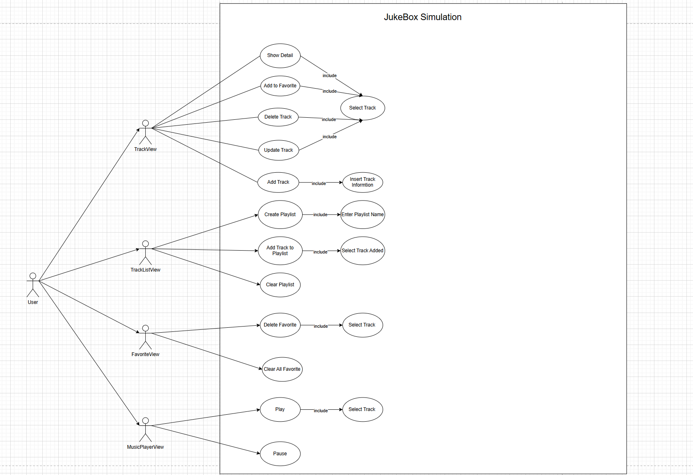
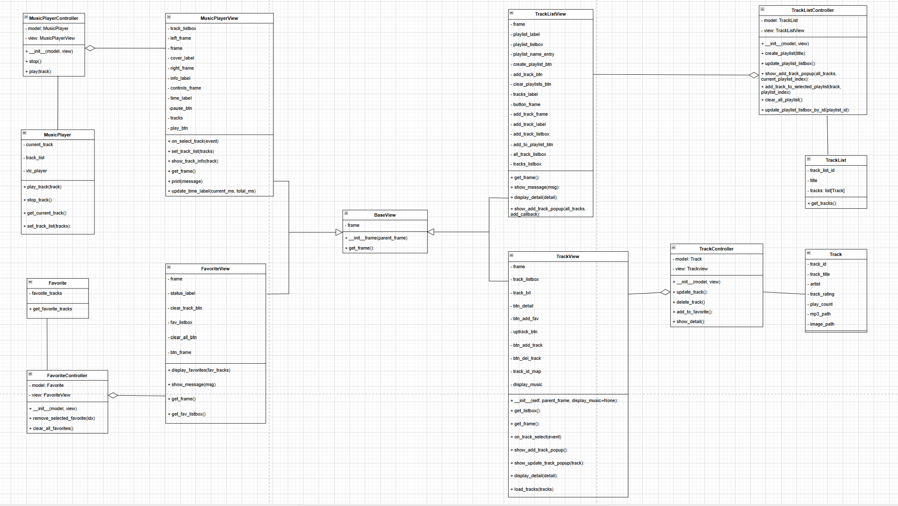

# Outline
# Python version
Recommend download python 3.12.3

## Cloning Repo
To clone this repo, use this scripts:
```
git clone https://github.com/DK0310/OOPCW
```
## Setup database
I use XAMPP mySQL, to install XAMPP go to:
```
https://www.apachefriends.org/download.html
```
Then run the XAMPP control panel, start the Apache and MySQL module. After that, press the admin button on MySQL, it should directed to PHPAdmin local host server. Then create a database named "jukebox", if you don't named it jukebox, it will cause an error. Finally, insert sql code which I put it in the db.sql file to jukebox database.
## Setup venv
```
python3.12 -m venv venv 
```
Or

```
py -3.12 -m venv venv
```
## Activate venv 
```
venv/scripts/activate
```

## Move into OOPCW directory
```
cd OOPCW
```

## Install essential packages
```
pip install requirement.txt
```


## Install VLC
Go to this website and download vlc player:
```
https://www.videolan.org/vlc/
```
### 
Then install VLC (recommend C drive). After finish download, locate where you install VLC. For instance:
```
C:\Program Files\VideoLAN\VLC
```
Or you just need to located the folder where the file " libvlc.dll " is in. Then paste the path to musicplayer.py in line 14 
### For Example
```
os.add_dll_directory(r"C:\Program Files\VideoLAN\VLC")  
```
Or
```
os.add_dll_directory(r"paste the path where the file "libvlc.dll" is located")  
```
## Run the simulation
To run, please enter this script
```
python main_GUI.py
```

## OOP Use case Diagram


## OOP class Diagram




